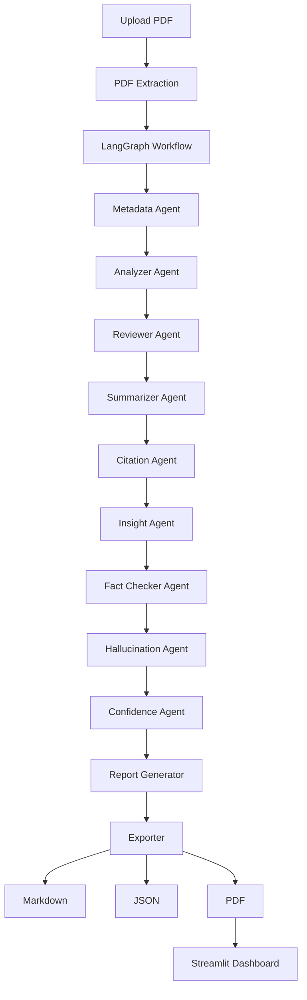

# ResearchMind AI Architecture

```mermaid
flowchart TD

A[Upload PDF]

A --> B[PDF Extraction]

B --> C[LangGraph Workflow]

C --> D[Metadata Agent]

D --> E[Analyzer Agent]

E --> F[Reviewer Agent]

F --> G[Summarizer Agent]

G --> H[Citation Agent]

H --> I[Insight Agent]

I --> J[Fact Checker Agent]

J --> K[Hallucination Agent]

K --> L[Confidence Agent]

L --> M[Report Generator]

M --> N[Exporter]

N --> O[Markdown]

N --> P[JSON]

N --> Q[PDF]

Q --> R[Streamlit Dashboard]
```